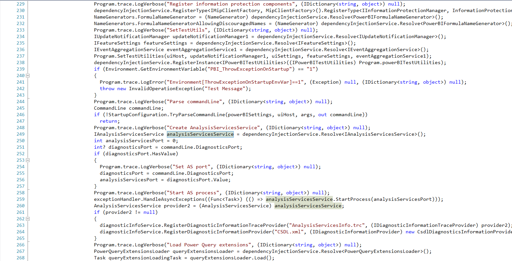
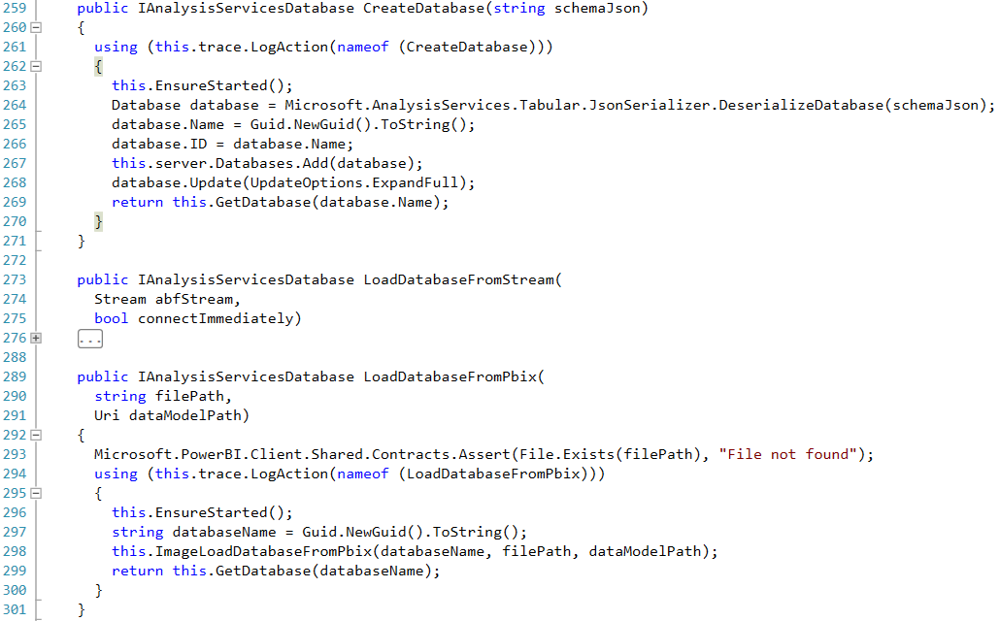
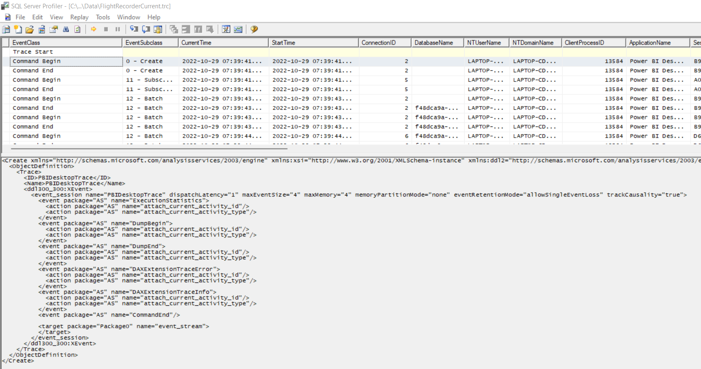

# Goal

Data lineage is important, but it's focused in the data engineer's world with tools like DBT. This is despite the fact that analysts are often the messiest data people. One big issue with tracking data lineage through to the final reports is the PowerBI is a black box. 

Although the .pbix is a simple zip file, the core data structures are stored in a DataModel file within the zip file. The DataModel file is compressed with XPress9, which appears to be different from the XPress algorithm. In any case, this compression is essentially undocumented and there are no simple utilities for decompressing the file.

Therefore, to get the data out of the PowerBI, we take a somewhat circuitous route. We instantiate a Microsoft Analysis Server locally, sending XMLA commands to load/save the PowerBI. 

# Journey

The core issue with programmatically accessing PowerBI data is that the `/DataModel` file is compressed with the  XPRESS9 algorithm. When searched online, you'll find [this](https://www.microsoft.com/en-us/research/wp-content/uploads/2016/02/fccm2014kim_cr.pdf) paper and 100's of engineers asking how to decompress *pbix* with people answering "this is how to extract it from *pbit*". After getting an unhelpful response from the researchers in the paper, we explore other options.

The first avenue was using [dotpeek](https://www.jetbrains.com/decompiler/) to extract the source code from the `powerbi.exe` file to replicate the compression algorithm. Sadly it turns out, the algorithm is in another castle. PowerBI uses a SSAS instance on the backend to manage the data and does no compression/decompression itself. With some more code spelunking, I was able to decypher how PowerBI instantiates and communicates with the SSAS service.

For reference, 
1. `powerbi.exe` links to the DLL `Microsoft.PowerBI.Client`. 
2. In the program function, an instance of `IAnalysisServicesService` is instantiated (see below for partial source)
3. This class is implemented in `Microsoft.PowerBI.Client.Windows.AnalysisServices.AnalysisServicesService`
4. Within this class are two functions that we care about (see below for source)
    - `CreateDatabase`
    - `LoadDatabaseFromPbix`
5. Going through the layers of code in these two functions becomes fuzzy due to the Injection-heavy code. However, two things become apparent:
    - Most of the configs, etc. connecting PowerBI to SSAS is stored in a folder named `C:\Users\[username]\AppData\Local\Microsoft\Power BI Desktop\AnalysisServicesWorkspaces\AnalysisServicesWorkspace_[GUID]\Data`
    - All communications between the two services go through XMLA
6. Going into the folder, SSAS thankfully provides us with a trace file (`FlightRecorderCurrent.trc`) that records every XMLA command sent to SSAS. Copying and editing these commands (see `/xmla`), we can load our own .pbix files and automatically retrieve the information in `/DataModel`! 
7. The final step involve(s/d) looking through another section of the source code to identify:
    - the exact executable running SSAS
    - the command line arguments PowerBI supplies to the executable
    - the initial XMLA commands PowerBI sends to enable PowerBI specific functionality







Note: all DLLs can be found in `C:\Program Files\Microsoft Power BI Desktop\bin`

# How it works
## Initialization
Initialization first checks if there is an existing Workspace. If there is, it checks whether the corresponding port is an active SSAS instance by attempting to query a list of databases in the instance. If there are no workspaces with a corresponding active SSAS instance, the program attempts to generate its own SSAS instance.

To create its own instance, the library generates a random UUID4, creates a corresponding workspace, and runs the command:

`'C:\Program Files\Microsoft Power BI Desktop\bin\msmdsrv.exe' "-c" "-n" {self.instance_name()} -s {self.data_directory()}`

It then iterates over every process currently running to find one with the name `msmdsrv.exe`.

It then gets the port of the first socket associated with that executable, saving that value to `msmdsrv.port.txt` to match PowerBI-generated workspaces.

[WIP] we then run [create_db](xmla/create_db.xml) to generate a database to load to with the appropriate permissions and PowerBI-specific extensions

## Loading PBIX to SSAS

We simply run [image_load](xmla/image_load.xml) with the appropriate values

## Saving PBIX from SSAS

Since the SSAS instance only saves a `/DataModel` and can only save files to the workspace, this has a few steps:

1. Copy PBIX to workspace
2. Run [image_save](xmla/image_save.xml) to update the PBIX `/DataModel`
3. Move the workspace PBIX to the intended save location

## Extracting Schema

After loading the PBIX to SSAS, we simply run [schema_query](xmla/schema_query.xml), returning an XML. We then run a simple process to convert that XML to JSON.

In `extract_library.dax_parser`, we have the `get_variables` which will return all variables in a DAX statement

[WIP] We then use [lark](https://lark-parser.readthedocs.io/en/latest/) to implement a [grammar](dax_parser.py) for Power Query, allowing us to parse the source information to identify the type/details of source as well as any additional manipulations being done to it.

# Examples

## Updating PowerBI

```
pbi = PowerBI('test.pbix')
pbi.list_tables()
```

```
# ['DateTableTemplate_ccb20219-f6e6-4499-a224-352c41e914ce', 'Sales', 'LocalDateTable_0b51e05f-c1c0-46c9-802c-55b15cfa43ff']
```

```
pbi.get_table('Sales').head()
```

```
[
    {'SalesOrderID': 'SO446221', 'Country': 'Germany', 'OrderDate': datetime.datetime(2011, 12, 1, 0, 0), 'SalesChannelCode': 'I', 'ProdID': 752, 'StyleName': 'Product0308010', 'CustomerAccountNumber': 'AW00013771', 'StoreKey': None, 'ProductLabel': 308010, 'ProductName': 'Contoso Power Inverter - DC to AC power inverter E900 Black', 'ProductDescription': 'Notebook essentials bundle - notebook accessories bundle', 'Manufacturer': 'Contoso, Ltd', 'BrandName': 'Contoso', 'Class': 'Economy', 'Color': 'Black', 'StockType': 'High', 'Units': 3, 'SalesAmount': 28.5, 'RePurch': 5, 'NSAT': 4, 'SubCategory': 'Computers Accessories', 'Category': 'Computers', 'Sale Size': 'Small'}, 
    {'SalesOrderID': 'SO437511', 'Country': 'France', 'OrderDate': datetime.datetime(2012, 2, 21, 0, 0), 'SalesChannelCode': 'I', 'ProdID': 751, 'StyleName': 'Product0308009', 'CustomerAccountNumber': 'AW00011592', 'StoreKey': None, 'ProductLabel': 308009, 'ProductName': 'Contoso Desktop Alternative Bundle E200 Black', 'ProductDescription': 'Desktop alternative bundle', 'Manufacturer': 'Contoso, Ltd', 'BrandName': 'Contoso', 'Class': 'Economy', 'Color': 'Black', 'StockType': 'High', 'Units': 3, 'SalesAmount': 34.5, 'RePurch': 5, 'NSAT': 4, 'SubCategory': 'Computers Accessories', 'Category': 'Computers', 'Sale Size': 'Small'}
]
```


```
pbi.update_tables(['Sales'])
# alternatives
# pbi.update_tables('Sales')
# pbi.update_tables()  # Updates all tables
pbi.save_image('test2.pbix')  # currently not that valuable, since updates cause process to freeze

```


## Getting Schema Information
```
from powerbi import PowerBI
pbi = PowerBI('test.pbix')
pbi.load_image()
schema = pbi.read_schema()
print(schema)
```
```
  {
    "Model": {},
    "DataSource": {},
    "Table": {},
    "Column": {},
    "AttributeHierarchy": {},
    "Partition": {},
    "Relationship": {},
    "Measure": {},
    "Hierarchy": {},
    "Level": {},
    "Annotation": {},
    ...
}
```

## Power Query Parser
```
from extract_library.m_parser import get_sources

get_sources(r"""let
    Source = Sql.Database(SqlServerInstance, SqlServerDatabase),
    dbo_DimProduct = Source{[Schema="dbo",Item="DimProduct"]}[Data],
    #"Filtered Rows" = Table.SelectRows(dbo_DimProduct, each ([FinishedGoodsFlag] = true)),
    #"Removed Other Columns" = Table.SelectColumns(#"Filtered Rows",{"ProductKey", "ProductAlternateKey", "EnglishProductName", "StandardCost", "Color", "ListPrice", "ModelName", "DimProductSubcategory"}),
    #"Expanded DimProductSubcategory" = Table.ExpandRecordColumn(#"Removed Other Columns", "DimProductSubcategory", {"EnglishProductSubcategoryName", "DimProductCategory"}, {"EnglishProductSubcategoryName", "DimProductCategory"}),
    #"Expanded DimProductCategory" = Table.ExpandRecordColumn(#"Expanded DimProductSubcategory", "DimProductCategory", {"EnglishProductCategoryName"}, {"EnglishProductCategoryName"}),
    #"Renamed Columns" = Table.RenameColumns(#"Expanded DimProductCategory",{{"EnglishProductName", "Product"}, {"StandardCost", "Standard Cost"}, {"ListPrice", "List Price"}, {"ModelName", "Model"}, {"EnglishProductSubcategoryName", "Subcategory"}, {"EnglishProductCategoryName", "Category"}, {"ProductAlternateKey", "SKU"}})
in
    #"Renamed Columns" 
""")
```

```
[{'type': 'Sql.Database', 'Schema': 'dbo', 'Table': 'DimProduct'}]
```

## Dax Parser

```
from extract_library.dax_parser import get_variables

get_variables("CALCULATE(SUM(Sales[Sales Amount]),PREVIOUSYEAR('Calendar'[Date]))")
```

```
[('Sales', 'Sales Amount', None), ('Calendar', 'Date', None)]  # each tuple is in the form (table, column, hierarchy)
```

## Contributions
The pyadomd sublibrary in this library is a fork of [here](https://pypi.org/project/pyadomd/), by [SCOUT](https://github.com/S-C-O-U-T). We made some alterations to handle our specific use cases, specifically:

1. Adding an executeXML function that runs XML and returns the result as a `bs4` tree.
2. Packaging the `AdomdClient.dll` alongside the library so it doesn't need to search for the client.